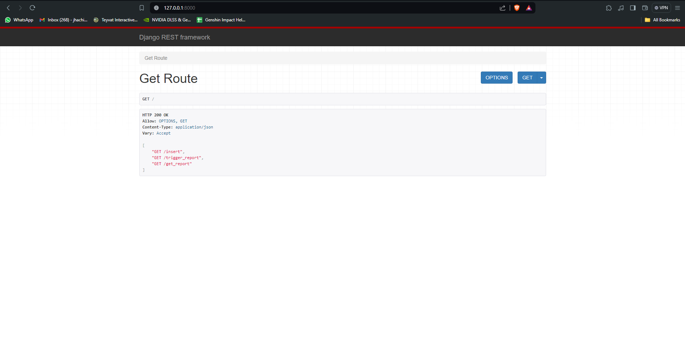
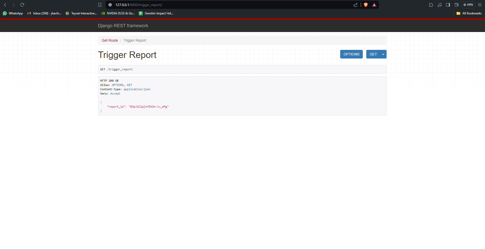
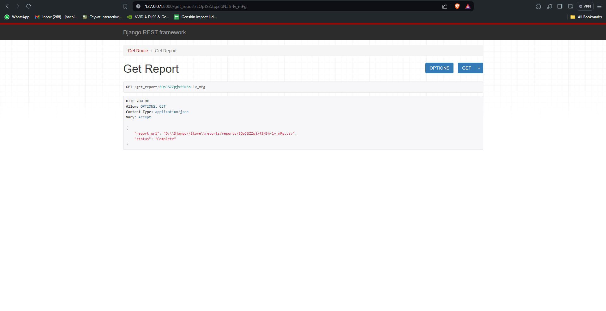

# RestaurantMonitoringSystem

## Setup

The first thing to do is to clone the repository:

```sh
$ git clone https://github.com/jhachirag7/income-expense-visualization.git
```
Then install the dependencies:

```sh
$ pip install virtualenv
```
Install,create and activate virtual environment

```sh
$ virtualenv env
```
```sh
$ Scripts\activate
```


```sh
(env)$ pip install -r requirements.txt
```
Note the `(env)` in front of the prompt. This indicates that this terminal
session operates in a virtual environment set up by `virtualenv`.

Once `pip` has finished downloading the dependencies:
```sh
(env)$ cd project
(env)$ python manage.py runserver
```

### Routes:


### trigger_report:


### get_report:



